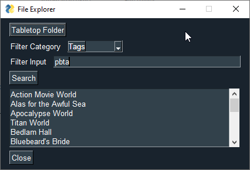

# Tabletop Folder Indexer
Needed a way to parse through the massive collection of tabletop pdfs I've accumulated over the years.
Made in about an hour with little python experience so it isn't the most performant or the prettiest to look at.

Each game's subdirectory has a info.json file using the following format:
```json
{
    "games": [
        {
            "name": "Beam Saber",
            "tags": ["Forged in the Dark"],
            "description": "Beam Saber is a Forged In The Dark game about the pilots of powerful machines in a war that dominates every facet of life. They are trying to do their part, then get out physically and mentally intact. The organizations that perpetuate The War throughout all of known space are too incomprehensibly huge to take down. There is no “winning” The War, there is only surviving it. Hopefully you can help others get out too.",
            "website": "https://austin-ramsay.itch.io/beamsaber",
            "author": ["Austin Ramsay"]
        },
        {
            "name": "Beam Saber - The Growing Conflict",
            "tags": ["Forged in the Dark", "Supplement"],
            "description": "The conflict grows as new types of Pilots emerge, new types of Squads appear, and new Factions are born! This supplement for Beam Saber features new ways to play including 6 new Pilot playbooks, 2 new Squad playbooks, and rules for forming and managing a Faction.",
            "website": "https://austin-ramsay.itch.io/thegrowingconflict",
            "author": ["Austin Ramsay"]
        }
    ]
}
```
Made using [PySimpleGUI](https://pypi.org/project/PySimpleGUI/)



# Improvements to be made
* Dynamically get filter categories so the application's scope can be broader.
* Dynamically get all tags at run-time and update the tool tip with them.
