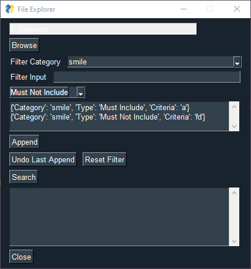

# Folder Indexer
An easy way to dynamically parse through your folders. Requires a .json file in each subdirectory with details about it. Program will pull each key in the json files and add them as categories that you can filter by.

Designed to be used to sort through Tabletop RPG PDFs, but can be used for anything.

Example usage
```json
{
    "games": [
        {
            "name": "Beam Saber",
            "tags": ["Forged in the Dark"],
            "description": "Beam Saber is a Forged In The Dark game about the pilots of powerful machines in a war that dominates every facet of life. They are trying to do their part, then get out physically and mentally intact. The organizations that perpetuate The War throughout all of known space are too incomprehensibly huge to take down. There is no “winning” The War, there is only surviving it. Hopefully you can help others get out too.",
            "website": "https://austin-ramsay.itch.io/beamsaber",
            "author": ["Austin Ramsay"]
        },
        {
            "name": "Beam Saber - The Growing Conflict",
            "tags": ["Forged in the Dark", "Supplement"],
            "description": "The conflict grows as new types of Pilots emerge, new types of Squads appear, and new Factions are born! This supplement for Beam Saber features new ways to play including 6 new Pilot playbooks, 2 new Squad playbooks, and rules for forming and managing a Faction.",
            "website": "https://austin-ramsay.itch.io/thegrowingconflict",
            "author": ["Austin Ramsay"]
        }
    ]
}
```
Made using [PySimpleGUI](https://pypi.org/project/PySimpleGUI/)


